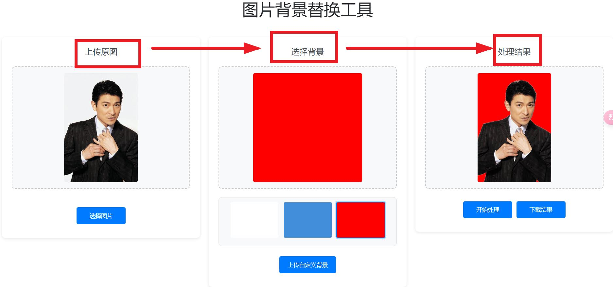

# 图片背景替换工具

这是一个基于Python Flask的在线图片背景替换工具。它使用rembg库来移除图片背景，并允许用户选择新的背景图片。

## 功能特点

- 上传原始图片
- 选择预设背景或上传自定义背景
- 实时预览
- 下载处理后的图片
- 支持常见图片格式（PNG、JPG、JPEG）

## 安装说明

1. 确保已安装Python 3.7或更高版本
2. 安装依赖包：
   ```bash
   pip install -r requirements.txt
   ```

3. 在static/backgrounds目录中放入一些背景图片样例

## 使用说明

1. 运行应用：
   ```bash
   python app.py
   ```

2. 在浏览器中访问 http://localhost:5000

3. 上传要处理的图片
4. 选择预设背景或上传自定义背景
5. 点击"开始处理"按钮
6. 处理完成后可以预览和下载结果

## 注意事项

- 支持的图片格式：PNG、JPG、JPEG
- 最大文件大小限制：16MB
- 建议使用清晰的图片以获得最佳效果

## 截图展示


